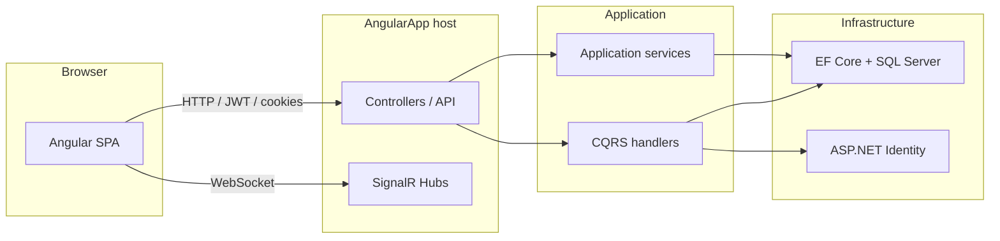

# AngularApp

A full-stack reference implementation built to **demonstrate software architecture, coding patterns, and technology integration**—not to ship a specific product domain (e.g. social network or storefront). The app bundles enough real features (authentication, logging, real-time messaging) to show how those concerns are structured end-to-end.

---

## What this project is for

| Goal | How it shows up here |
|------|----------------------|
| **Layered / clean architecture** | Separate `Domain`, `Application`, `Infrastructure`, and host (`AngularApp`) projects |
| **CQRS-style handlers** | Commands and queries with `ICommandHandler` / `IQueryDispatcher` and Scrutor-based registration |
| **ASP.NET Core + Angular** | API hosts the SPA build; JWT + cookie auth; SignalR for notifications and chat |
| **Persistence & identity** | Entity Framework Core, ASP.NET Identity, SQL Server |
| **Testing** | xUnit unit tests and `WebApplicationFactory` integration tests |

Use this repo as a **portfolio piece** or **starting template** when you want conventions and wiring—not a production-ready SaaS blueprint.

---

## Tech stack

### Backend (`src/`)

| Area | Technologies |
|------|----------------|
| Runtime | .NET 9 |
| Web | ASP.NET Core (MVC + API), static SPA hosting |
| Data | Entity Framework Core 9, SQL Server |
| Security | ASP.NET Identity, JWT Bearer, HTTP-only cookies |
| Real-time | SignalR (including Azure SignalR in configured environments) |
| Jobs | Quartz.NET (infrastructure) |
| Observability | OpenTelemetry / Azure Monitor (optional, commented in host) |

### Frontend (`AngularApp/`)

| Area | Technologies |
|------|----------------|
| Framework | Angular 20 |
| UI | Bootstrap 5, ng-bootstrap, Font Awesome |
| Real-time | `@microsoft/signalr` |
| Auth helpers | `jwt-decode` |

### Tests (`tests/`)

- **xUnit**, **FluentAssertions**, **Moq**
- **Microsoft.AspNetCore.Mvc.Testing** for HTTP integration tests
- EF **InMemory** where persistence is exercised in isolation

---

## Solution layout

```text
AngularApp/
├── src/
│   ├── Domain/              # Entities, enums, factories (no infrastructure)
│   ├── Application/       # Use cases: CQRS handlers, services, DTOs, dispatchers
│   ├── Infrastructure/      # EF Core, Identity store, migrations, background jobs
│   └── AngularApp/          # ASP.NET host: controllers, SignalR hubs, DI, wwwroot
├── AngularApp/              # Angular SPA (build output copied into host wwwroot on build)
└── tests/
    ├── Domain.UnitTests/
    ├── Application.UnitTests/
    ├── AngularApp.IntegrationTests/
    └── Infrastructure.IntegrationTests/
```



---

## Patterns & practices (high level)

- **Separation of concerns**: domain rules and types stay in `Domain`; orchestration in `Application`; I/O in `Infrastructure`.
- **CQRS-style dispatching**: handlers implement `ICommandHandler<>` / `IQueryHandler<,>`; `CommandDispatcher` and `QueryDispatcher` resolve them from DI.
- **Scrutor** scans the application assembly and registers handlers by convention.
- **Abstractions for side effects**: e.g. `INotificationPublisher` for SignalR-backed notifications (easier to fake in tests).
- **Testing**: unit tests for domain and application logic; integration tests for HTTP endpoints with test doubles where external systems must not be contacted.

---

## Prerequisites

- [.NET 9 SDK](https://dotnet.microsoft.com/download)
- [Node.js LTS](https://nodejs.org/) (for the Angular app)
- SQL Server (LocalDB, Docker, or Azure) for a full run with real data
- Optional: npm at repo root if you use root-level tooling

---

## Run locally

### 1. Backend API + hosted SPA

From the repository root:

```bash
cd src/AngularApp
dotnet run
```

On first run, ensure **connection strings** and **JWT** settings in `appsettings.json` (or user secrets / environment variables) match your SQL instance and secrets.

The Angular SPA is normally built and copied into `wwwroot` by the web project’s build target (see `AngularApp.csproj`). For a clean full build from the backend folder:

```bash
dotnet build
```

Set `RUNNING_IN_DOCKER=true` if you need to skip the npm build step in CI/Docker.

### 2. Angular dev server only (optional)

For fast UI iteration with the CLI:

```bash
cd AngularApp
npm ci
npm start
```

Point the SPA at your API base URL as configured in your Angular environment files.

---

## Tests

```bash
dotnet test
```

- **Unit tests** exercise domain factories, application services, handlers, and dispatchers with mocks or EF InMemory.
- **Integration tests** use `WebApplicationFactory` for real HTTP routing; external services (e.g. live SignalR broadcasts) are replaced with test doubles where appropriate.

---

## Configuration notes

- **Database**: `Infrastructure` uses EF Core; migrations live under `src/Infrastructure/Migrations/`.
- **JWT**: Issuer, audience, signing key, and expiry are read from configuration (`Jwt:*`).
- **Azure SignalR**: Used when `AddRealTime` is configured with `AzureSignalRConnectionString`; integration tests should not rely on live Azure endpoints.
- **CORS / HTTPS**: Policies are tuned for local and deployed front-end URLs—adjust for your environment.

---

## License

Add a license file if you intend to share or reuse this repository publicly.

---

*This README describes the repository’s intent: **patterns, structure, and technology showcase**—not a single product mission.*
